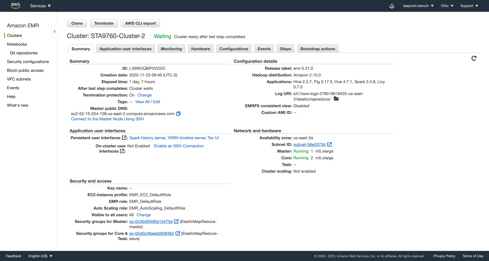
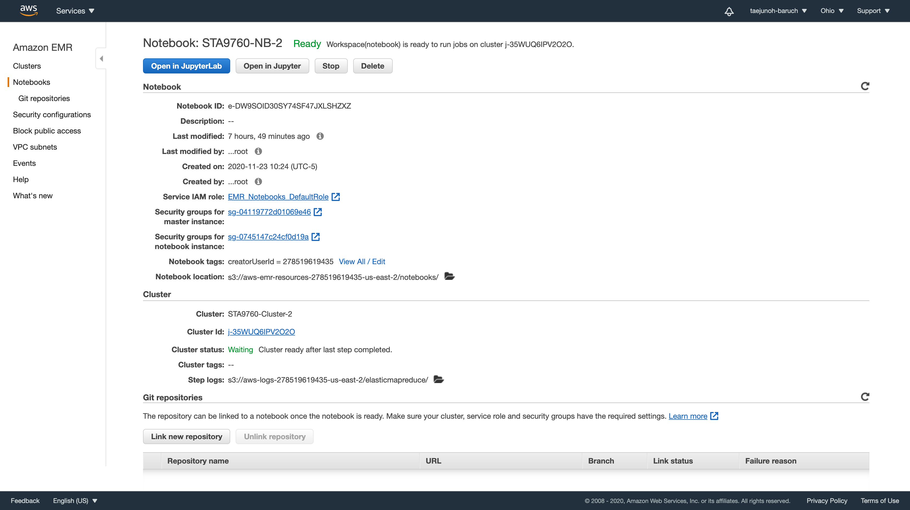

# ANALYSIS OF YELP DATASET

For this project, I analyzed 10Gb of Yelp dataset including business, checkin, review, tip, and users data. I downloaded it from Kaggle and uploaded to my AWS S3 bucket.

I provisioned a Spark cluster on AWS EMR and connected it to a Jupyter Notebook. I performed data analysis with PySpark to deal with large datasets.

## Files
You can see my code and anlysis in both ipynb and pdf file.

Two screenshots below show how I configured AWS EMR and Notebook.

****

****

## Part I: Installation and Initial Setup
I imported necessary dependencies such as pandas, matplotlib, and seaborn, and loaded Yelp dataset as a PySpark dataframe from my S3 bucket.

## Part II: Analyzing Categories
I analyzed categories of business data. I split categories into unique categories and created a bar chart of top 20 categories.

## Part III: Do Yelp Reviews Skew Negative?
I tried to answer the question, "Do Yelp reviews skew negative?" I analyzed review and business data to compare the written review and the overall business rating. I calculated skewness values and created a skew distribution plot. To decide I used Pearson's coefficient of skewness.

## Part IV: Should the Elite be Trusted?

For this part, I tried to know the Elite user should be trusted. I analyzed three data such as user, business, and review. I compared the Elite's review and the overall business rating. Like Part III, I calculated skewness values and generated the skew distribution plot. I also used Pearson's coefficient of skewness.
